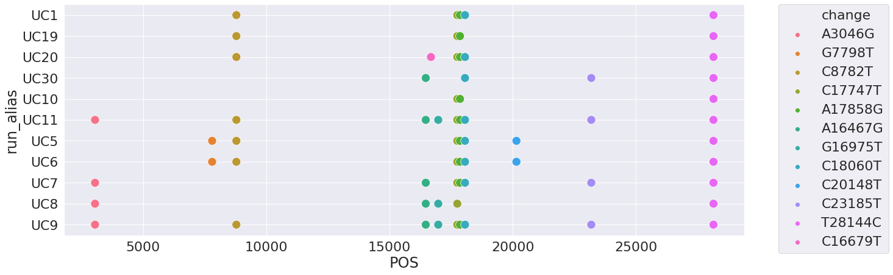

# Analysis of [Deng 2020](https://science.sciencemag.org/content/early/2020/06/05/science.abb9263) data

A recent publication by Deng et al. [(2020)](https://science.sciencemag.org/content/early/2020/06/05/science.abb9263) analyzed transmission patters of SARS-CoV2 in Northern California. This is one of very rare SARS-CoV2 publications in that it makes primary data (sequencing reads) available (BioProject [PRJNA629889](https://www.ncbi.nlm.nih.gov/bioproject/PRJNA629889)).     

We are a part of the GalaxyProject [effort](https://covid19.galaxyproject.org) aimed at developing open and freely accessible practices for the computational analyses of SARS-CoV2 data. As a part of this effort we already automatically downloaded and processed these data. Naturally, we decided to look if the results of our pipeline agree with the results reported by Deng et al. Here is what we discovered. 

## Data and associated metadata discrepancy: 36 patients, 44 SRA datasets, and 66 samples.

The paper states that the authors analyzed 36 infected patents. The corresponding short read archive data corresponding to [PRJNA629889](https://www.ncbi.nlm.nih.gov/bioproject/PRJNA629889) lists 43 samples with the following metadata (an example representing one sample):

|    | study_accession   | experiment_accession   | experiment_title                                | experiment_desc                                 |   organism_taxid  | organism_name                                   | library_strategy   | library_source   | library_selection   | sample_accession   |   sample_title | instrument            |   total_spots |   total_size | run_accession   |   run_total_spots |   run_total_bases | run_alias     | sra_url_alt1                                                              | sra_url_alt2                                                              | sra_url                                                                   |   experiment_alias |   Titer (Ct value) | Sequencing Platform   |   Distinguishing Info | strain         | isolate        | collected_by                           | collection_date   | geo_loc_name   | host         | host_disease   | isolation_source   | lat_lon              | BioSampleModel   | sra_url_alt                                                                             | ena_fastq_url                                                                   | ena_fastq_ftp                                                                      |
|---:|:------------------|:-----------------------|:------------------------------------------------|:------------------------------------------------|------------------:|:------------------------------------------------|:-------------------|:-----------------|:--------------------|:-------------------|---------------:|:----------------------|--------------:|-------------:|:----------------|------------------:|------------------:|:--------------|:--------------------------------------------------------------------------|:--------------------------------------------------------------------------|:--------------------------------------------------------------------------|-------------------:|-------------------:|:----------------------|----------------------:|:---------------|:---------------|:---------------------------------------|:------------------|:---------------|:-------------|:---------------|:-------------------|:---------------------|:-----------------|:----------------------------------------------------------------------------------------|:--------------------------------------------------------------------------------|:-----------------------------------------------------------------------------------|
|  0 | SRP265005         | SRX8409213             | Severe acute respiratory syndrome coronavirus 2 | Severe acute respiratory syndrome coronavirus 2 |           2697049 | Severe acute respiratory syndrome coronavirus 2 | AMPLICON           | METAGENOMIC      | PCR                 | SRS6721570         |            nan | Illumina HiSeq 1500   |         13478 |      1016143 | SRR11859166     |             13478 |           1886920 | UC13.fastq.gz | https://storage.googleapis.com/sra-pub-src-9/SRR11859166/UC13.fastq.gz.1  | https://sra-pub-src-9.s3.amazonaws.com/SRR11859166/UC13.fastq.gz.1        | https://sra-download.ncbi.nlm.nih.gov/traces/sra74/SRR/011581/SRR11859166 | nan | 27.5 | HiSeq | 13 | Not applicable | Not applicable | University of Califronia San Francisco | 2020-03-02 | USA:California | Homo sapiens | Acue infection | clinical sample    | 36.7783 N 119.4179 W | Pathogen.cl      | nan| nan | nan |

One can see that many useful columns are either empty (e.g., `sample_title`) or do not contain useful information (e.g., `geo_loc_name`). This is unfortunate as their supplemental Table S1 contains Sample Lab IDs and it is impossible to figure out which is which. In addition, Table S1 lists 66 samples. So there is a discrepancy: 36 patients, 44 SRA datasets, and 66 samples.

Downloading data resulted in 25 single end and 18 paired end datasets. We performed initial QC using [`fastp`](https://github.com/OpenGene/fastp), to remove low quality reads as well as to detect and trim Illumina adapter sequences:


There is substantial duplication levels expected from amplicon sequencing.  

## Processing ampliconic data

The paper used a combination of [PrimalSeq](https://genomebiology.biomedcentral.com/articles/10.1186/s13059-018-1618-7) and [MSSPE](https://pubmed.ncbi.nlm.nih.gov/31932713/) approaches. It is not easy to obtain information on which samples were processed with MSSPE or PrimalSeq schemes based on SRA metadata. It is interesting that such data appears when looking at individual SRR accession:


but is absent is one obtains metadata either from SRA website or programatically via API:

```
Run,ReleaseDate,LoadDate,spots,bases,spots_with_mates,avgLength,size_MB,AssemblyName,download_path,Experiment,LibraryName,LibraryStrategy,LibrarySelection,LibrarySource,LibraryLayout,InsertSize,InsertDev,Platform,Model,SRAStudy,BioProject,Study_Pubmed_id,ProjectID,Sample,BioSample,SampleType,TaxID,ScientificName,SampleName,g1k_pop_code,source,g1k_analysis_group,Subject_ID,Sex,Disease,Tumor,Affection_Status,Analyte_Type,Histological_Type,Body_Site,CenterName,Submission,dbgap_study_accession,Consent,RunHash,ReadHash
SRR11859129,2020-05-27 19:18:31,2020-05-27 19:15:05,8544351,1196209140,0,140,471,,https://sra-download.ncbi.nlm.nih.gov/traces/sra13/SRR/011581/SRR11859129,SRX8409250,UC9,AMPLICON,PCR,METAGENOMIC,SINGLE,0,0,ILLUMINA,NextSeq 550,SRP265005,PRJNA629889,,629889,SRS6721607,SAMN14814520,simple,2697049,Severe acute respiratory syndrome coronavirus 2,UC9,,,,,,,no,,,,,UNIVERSITY OF CALIFORNIA SAN FRANCISCO,SRA1080605,,public,825111F66EB84365F13645E3B72D7E51,32C9A5C7D306B056894F947B39681331
```

The paper lists Tiling multiplex PCR primers (Supplemental Table 4) but does not specify which version of ARTIC set they correspond to. We use text matching to figure out that Supplemental Table 4 is identical to [V1](https://github.com/artic-network/artic-ncov2019/tree/master/primer_schemes/nCoV-2019/V1) of ARTIC SARS-CoV2 primer set. To process data we:

- mapped all 43 datasets against SARS-CoV2 genome ([NC_045512.2](https://www.ncbi.nlm.nih.gov/nuccore/NC_045512))
- processed resulting BAM files with `ivar trim` using `-e` option that retains reads with no primers detected using ARTIC V1 [primer coordinates](https://raw.githubusercontent.com/artic-network/artic-ncov2019/master/primer_schemes/nCoV-2019/V1/nCoV-2019.bed) 
- processed output of the previous step with `ivar trim` using `-e` option using bed file containing coordinates of MSSPE primer set
- for paired-end data we retained only reads mapped in the proper orientation (`---> <---`).

To obtain coordinates of MSSPE primers we mapped primer sequences (obtained from Supplemental Table 3) against [NC_045512.2](https://www.ncbi.nlm.nih.gov/nuccore/NC_045512) and converted resulting BAM file into BED file using `BEDTools`

## Calling and analyzing variants

### Calling variants

We called variants using the same procedure as described [here](https://covid19.galaxyproject.org/genomics/4-Variation/). We did not deduplicated BAM files as these are ampliconic data. Briefly we used [`lofreq`](https://github.com/CSB5/lofreq) to:

- realign the reads (`lofreq vitebi`)
- insert indel qualities (`lofreq indelqual --dindel`)
- call variants (`lofreq call`)

The resulting list of variants is [here](variants.tsv)

### Analysis

#### US Grand Princess (USGP) cruise ship

The authors state that all 11 genomes from USGP are a part of the WA1 lineage. This means that they contain `C8782T`, `C18060T`, and `T28144C` substitutions defining this lineage as well as `C17747T` ans `A17858G`. In addition six passengers of the voyage A carried `G16975T` and `C23185T`. 

The trouble starts with the fact that Fig. 3 of the manuscript lists UC7 - UC11 as Voyage **B** passengers, while text lists then as **A**.  However, let us assume for the a moment that UCs 1,5,6,7,8,9,10,11,19,20,30 are simply "cruise ship" samples. Do we see the described substitutions?

The following figure shows distribution of substitutions with alternative allele frequencies over 90% across the genome:



only `T28144C` is universal, while others are distributed seemingly randomly. The substitutions `C17747T` ans `A17858G` defining USGP lineage are present in *almost* all samples with the exception of `UC8` and `UC30`:


The `A17858G` is not called in UC08 because of the extreme strand bias:


It also happens to be a widely distributed substitution based on GISAID data as shown by the analysis performed by [Sergei Kosakovsky-Pond](https://observablehq.com/@spond/distribution-of-sars-cov-2-sequences-that-have-a-particular):


#### Santa Clara Country (SCC)

The situation is considerably less clear with Santa Clara County (SSC data). Out of 10 samples (`"SantaClara":["UC13","UC15","UC14","UC16","UC17","UC34","UC35","UC18","UC25","UC21"]`) only five have **any** changes with alternative allele frequency above 90%:


Moreover only two samples share `G29711T` non-coding substituion, which according to the paper defined SSC clade. Again, let's look at the reads:


IN PROGRESS ...
